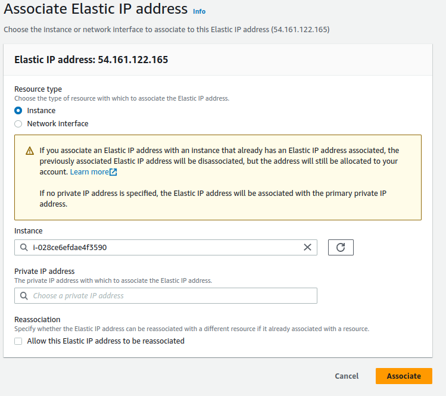
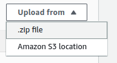
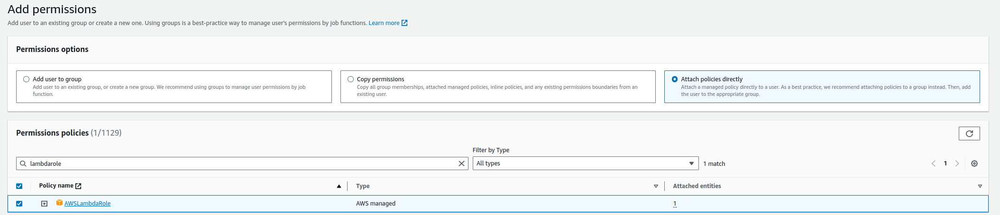

# AWSmcserverautomation
A tutorial on how to set up a private minecraft server with EC2 that automatically turns off after 3 (or however many hours you want). I also include a way to setup a private static website that allows you to turn on the server with a seperate IAM user's access key.

I could have set this up using ECS and EFS, but for a small server with very little usage, aswell as the cost and ability for others to replicate, EC2 better adheres to what is needed

## Prerequisies
- I set all of this up in US-EAST-1, in order to change this, you might have to change it in some of the code but I'll tell you when later; Or just use Global Accelerator :)
- Setup a public VPC & Subnet

## STEP 1: Create the EC2 & Security Group
### I used Amazon 2023 as the AMI


---


### I set the type as t2.medium
t2.medium is NOT under the free tier btw, but I think 4gb of ram is the minimum for a minecraft server personally


---

### Select your VPC, Subnet, and add your SG Rules
- Allow SSH for YOUR IP
- Allow TCP Port 25565 (minecraft port) for anywhere


---

### I gave it 8gb of gp3, which is under the free tier tier, you can go lower or higher
Once done, go ahead and launch your EC2


---


## Step 2: Create the Elastic IP and associate it with your EC2 Instance


### Click Allocate Elastic IP address


---

### Click Allocate


---

### Now associate the Elastic IP with your ec2 instance





---

### Once done copy the allocate ipv4 address, you will need this later


---


## Step 3: Setup Minecraft


### SSH into your instance


---

### We now need to install Java on our instance

Go ahead and run these commands:


These will import our repo

```console
sudo rpm --import https://yum.corretto.aws/corretto.key 
```

```
sudo curl -L -o /etc/yum.repos.d/corretto.repo https://yum.corretto.aws/corretto.repo
```


This will install Java 17

```
sudo yum install -y java-17-amazon-corretto-devel
```

This will test what Java version you have; Verify with the screenshot below

```console
java --version
```


---

### We now need to add a user and give it a directory

Run these commands

```console
sudo adduser minecraft
```

```console
sudo su
```

```console
mkdir /opt/minecraft/
```

```console
mkdir /opt/minecraft/server/
```

```console
cd /opt/minecraft/server/
```


---

### We now need to download the Server JAR and initialize the files

```console
wget https://piston-data.mojang.com/v1/objects/5b868151bd02b41319f54c8d4061b8cae84e665c/server.jar
```

```console
java -Xmx1024m -Xms1024m -jar server.jar nogui
```

You should now receive an error "Failed to load eula.txt"

---


---

### We will now edit the "eula.txt" file to agree to the minecraft eula 

Open the file

```console
vim eula.txt
```


Press the I key to edit

Change "eula=false" to "eula=true"


Type 
```
:wq
```
 to save and quit


---

### Now we will give the user permissions

```console
sudo chown -R minecraft:minecraft /opt/minecraft/
```


---

## Now we will make a service file

```console
sudo vim /etc/systemd/system/minecraft.service
```


Paste the following config

```console
[Unit]
Description=Mineraft Server
After=network.target

[Service]
User=minecraft
Nice=5
KillMode=none
SuccessExitStatus=0 1
NoNewPrivileges=true
WorkingDirectory=/opt/minecraft/server
ReadWriteDirectories=/opt/minecraft/server
ExecStart=/usr/bin/java -Xmx3900M -Xms1024M -jar server.jar nogui
ExecStop=/opt/minecraft/tools/mcrcon/mcrcon -H 127.0.0.1 -P 25575 -p strong-password stop

[Install]
WantedBy=multi-user.target
```

Now make sure to change the "-Xmx3900M" part to whatever max RAM you want to allocate

 Once done type 
 ```console
:wq
```
 to save and quit


---

### Now we will make a service from our service file

Type the following commands:

```console
chmod 664 /etc/systemd/system/minecraft.service
```

```console
systemctl daemon-reload
```

```console
systemctl enable minecraft.service
```

This will make the server start when the EC2 Instance gets started


---

## Step 4: Create our Lambda functions


### Create our mc_start function
- Name it "mc_start"
- Use the "Node.js 14.x" runtime


---

### We will now upload our zip file for mc_start
[mc_start.zip](/mc_start.zip)





---

### Add our environment variables for mc_start
1. Click configuration
2. Click Environment Variables
3. Set the Key as "INSTANCE_ID"
4. Set the Value as your EC2 instance ID


It should look like this:


---

### We will now give our mc_start function permission to access our EC2

Go to Permissions and click on the role name


It should look like this:


Click "Add permissions" then click "Attach policies"


We will attach the following policy:


---

### We will now create our mc_stop function

Do the same configuration as before but name it "mc_stop"


Upload [mc_stop.zip](/mc_stop.zip)


Now the environment variables:
- INSTANCE_ID (KEY: same as before)
- MAX_HOURS (KEY: however many hours you want it to run for, "3" for 3 hours)


Now we will add our trigger
1. Click Triggers
2. Click Add trigger


Set it to the following:


--- 

## Step 5: Make our IAM User
name it "minecraft"


We will attach the "AWSLambdaRole" Policy



Click Create User


Once created go to the user and click "Security Credentials"


1. Click "Create Access Key"
2. Click "Application running outside AWS"
3. READ THE WARNING REGARDING ACCESS KEY STORAGE, (this is important, do not store this in plain text and further on we will make a static website, ALWAYS CHECK FOR HTTPS)
4. Do not lose this access key


---

## Step 6: Create our Static Website (for remote starting)

1. Download [index.html](/index.html) and open it in a text editor
2. Change the region to whichever you are using for your VPC


Now we will create our S3 Bucket


Upload the index.html file you saved


In you Properties Tab, you want to copy the ARN for the bucket


Now click Permissions


Now edit the bucket policy
Use the following JSON and make sure to type in your ARN from earlier:
```json
{
    "Version": "2012-10-17",
    "Statement": [
        {
            "Effect": "Allow",
            "Principal": "*",
            "Action": "s3:GetObject",
            "Resource": "PASTE_ARN_HERE/*"
        }
    ]
}
```

Once saved, this bucket will now have public read access


---

## Step 7: Create the CloudFront Distribution

Click "Create Distribution"


Use the following settings and use you bucket as the origin:


It can take up to 20 minutes to deploy, give it time

Once deployed, enable static website hosting


The Distribution Domain Name will be your website's url


This website will use your access key for authentication

ALWAYS MAKE SURE THE CONNECTION IS SECURE AND USING HTTPS

You can give it your access key from earlier then click the "Start Server" button

If everything is working, you should get a popup after a few seconds that looks like this:


# Congrats, your server with remote access is setup!
