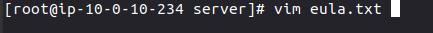

# AWSmcserverautomation
A tutorial on how to set up a private minecraft server with EC2 that automatically turns off after 3 (or however many hours you want). I also include a way to setup a private static website that allows you to turn on the server with a seperate IAM user's access key.

I could have set this up using ECS and EFS, but for a small server with very little usage, aswell as the cost and ability for others to replicate, EC2 better adheres to what is needed

## Prerequisies
- I set all of this up in US-EAST-1, in order to change this, you might have to change it in some of the code but I'll tell you when later; Or just use Global Accelerator :)
- Setup a public VPC & Subnet

## STEP 1: Create the EC2 & Security Group
### I used Amazon 2023 as the AMI


---


### I set the type as t2.medium
t2.medium is NOT under the free tier btw, but I think 4gb of ram is the minimum for a minecraft server personally


---

### Select your VPC, Subnet, and add your SG Rules
- Allow SSH for YOUR IP
- Allow TCP Port 25565 (minecraft port) for anywhere


---

### I gave it 8gb of gp3, which is under the free tier tier, you can go lower or higher
Once done, go ahead and launch your EC2


---


## Step 2: Create the Elastic IP and associate it with your EC2 Instance


### Click Allocate Elastic IP address


---

### Click Allocate


---

### Now associate the Elastic IP with your ec2 instance


---

### Once done copy the allocate ipv4 address, you will need this later


---


## Step 3: Setup Minecraft


### SSH into your instance


---

### We now need to install Java on our instance

Go ahead and run these commands:


These will import our repo

```console
sudo rpm --import https://yum.corretto.aws/corretto.key 
```

```
sudo curl -L -o /etc/yum.repos.d/corretto.repo https://yum.corretto.aws/corretto.repo
```


This will install Java 17

```
sudo yum install -y java-17-amazon-corretto-devel
```

This will test what Java version you have; Verify with the screenshot below

```console
java --version
```


---

### We now need to add a user and give it a directory

Run these commands

```console
sudo adduser minecraft
```

```console
sudo su
```

```console
mkdir /opt/minecraft/
```

```console
mkdir /opt/minecraft/server/
```

```console
cd /opt/minecraft/server/
```


---

### We now need to download the Server JAR and initialize the files

```console
wget https://piston-data.mojang.com/v1/objects/5b868151bd02b41319f54c8d4061b8cae84e665c/server.jar
```

```console
java -Xmx1024m -Xms1024m -jar server.jar nogui
```

You should now receive an error "Failed to load eula.txt"

---


---

### We will now edit the "eula.txt" file to agree to the minecraft eula 

Open the file

```console
vim eula.txt
```




Press the I key to edit

Change "eula=false" to "eula=true"


Type 
```
:wq
```
 to save and quit


---

### Now we will give the user permissions

```console
sudo chown -R minecraft:minecraft /opt/minecraft/
```


---

## Now we will make a service file

```console
sudo vim /etc/systemd/system/minecraft.service
```


Paste the following config

```console
[Unit]
Description=Mineraft Server
After=network.target

[Service]
User=minecraft
Nice=5
KillMode=none
SuccessExitStatus=0 1
NoNewPrivileges=true
WorkingDirectory=/opt/minecraft/server
ReadWriteDirectories=/opt/minecraft/server
ExecStart=/usr/bin/java -Xmx3900M -Xms1024M -jar server.jar nogui
ExecStop=/opt/minecraft/tools/mcrcon/mcrcon -H 127.0.0.1 -P 25575 -p strong-password stop

[Install]
WantedBy=multi-user.target
```

Now make sure to change the "-Xmx3900M" part to whatever max RAM you want to allocate

 Once done type 
 ```console
:wq
```
 to save and quit


---

### Now we will make a service from our service file

Type the following commands:

```console
chmod 664 /etc/systemd/system/minecraft.service
```

```console
systemctl daemon-reload
```

```console
systemctl enable minecraft.service
```

This will make the server start when the EC2 Instance gets started

---

## Step 4: Create our Lambda functions


### Create our mc_start function
- Name it "mc_start"
- Use the "Node.js 14.x" runtime


---

### We will now upload our zip file
[mc_start.zip](/mc_start.zip)


---


